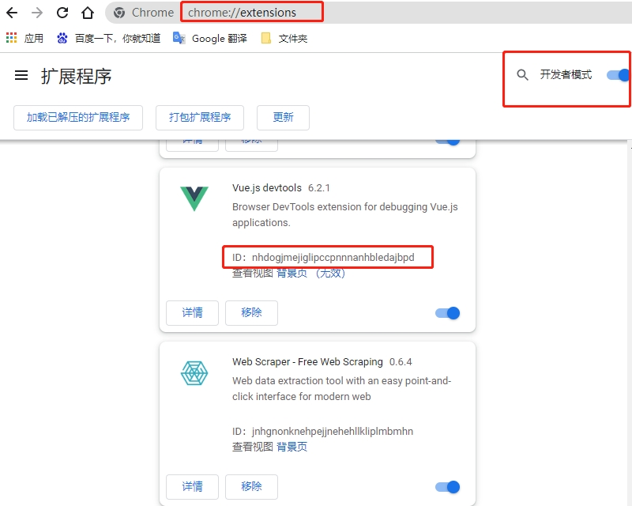
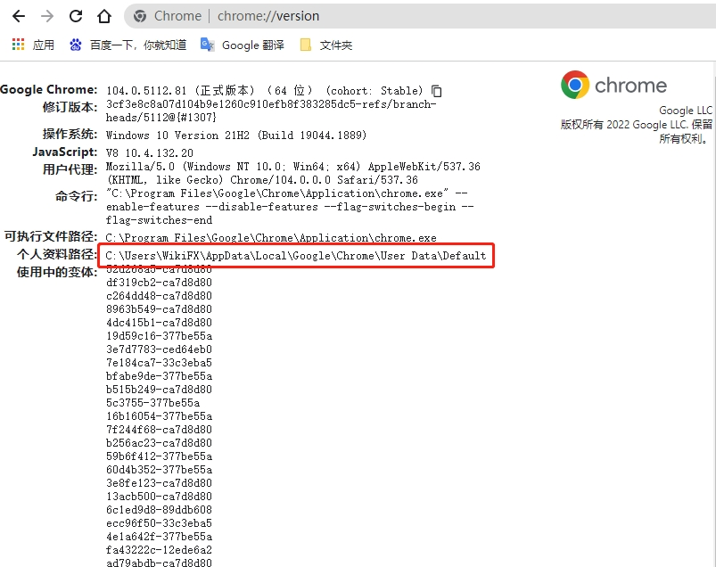
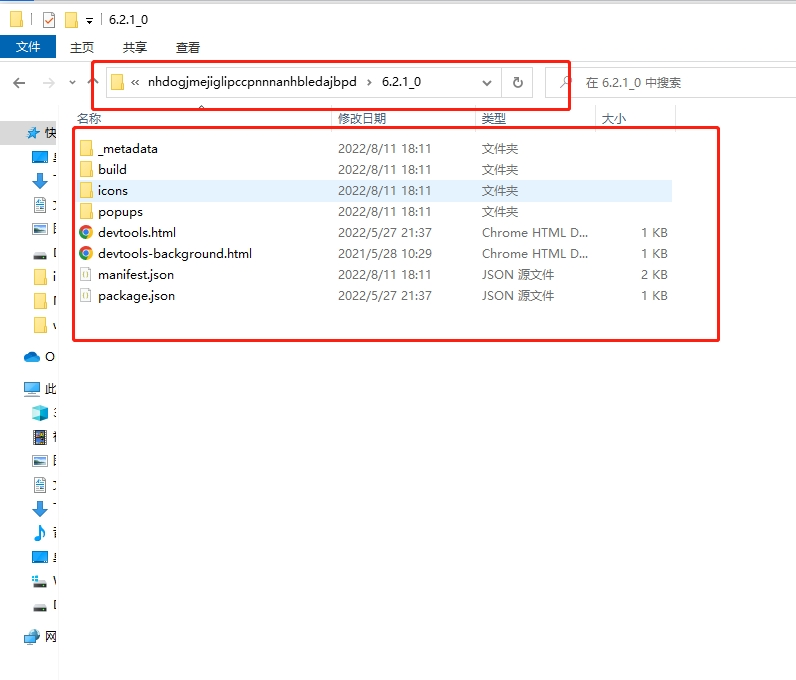

# electron [vue-devtools] 安装

- 首先需要安装vue-devtools 有两种安装方式 
  - `本地chrome插件安装包`
  - `github下载自己打包安装`

``` javascript
// electron 13.0版本之后 addDevToolsExtension已经弃用
// 改为session.defaultSession.loadExtension 
// 在 Electron 13 中移除
BrowserWindow.addExtension(path)
BrowserWindow.addDevToolsExtension(path)
// 用...来代替
session.defaultSession.loadExtension(path)

// 在 Electron 13 中移除
BrowserWindow.removeExtension(name)
BrowserWindow.removeDevToolsExtension(name)
// 用...来代替
session.defaultSession.removeExtension(extension_id)

// 在 Electron 13 中移除
BrowserWindow.getExtensions()
BrowserWindow.getDevToolsExtensions()
// 用...来代替
session.defaultSession.getAllExtensions()
```
> 所以之前各种百度出来的方法都不能用了，专门出一个避坑指南！！

## 本地chrome插件安装
- 如果你的本地chrome已经安装过`vue-devtools`了，并且不想再去[github](https://github.com/vuejs/vue-devtools){:target="_blank"}上下载进行打包折腾，那就用这个方法
  - `chrome://extensions/` 进入插件管理页面，勾选开发者模式，找到对应插件的 ​id​
  

  - 通过 ​`chrome://version/`​ 可以查看浏览器的信息，浏览器所有插件的路径都在。
  
  
  - 找到的vue-tools插件id 在插件路径里面的 Extensions 文件夹查找对应的id
  

  - 把里面所有文件都复制到项目中的新建文件夹`（你也可以不在项目中新建目录直接贴你本地的目录，协同开发的话添加到项目中比较好，不用每个人都修改配置文件）` 然后再 Electron入口文件里面进行配置
  ```javascript
    // 我是放到项目的根目录 \devTools\chrome\
    app.on('ready', () => {
      // import { app, BrowserWindow, shell, ipcMain, session } from 'electron'
      // 需要引入 session
      // BrowserWindow.addDevToolsExtension 已弃用
      // 使用session.defaultSession.loadExtension
      // 添加vue插件
      session.defaultSession.loadExtension(
        resolve(__dirname, '../../../devTools/chrome')
        // 这个是项目中新建插件目录，把所有的文件都复制进来
      )
    })
  ```

> 然后你就可以在electron上面愉快的使用 vue-devTools了！！！


## github下载打包安装

- 去[vue-devtools](https://github.com/vuejs/vue-devtools){:target="_blank"} 下载zip包或者从github克隆vue-devtools

```bash
  git clone https://github.com/vuejs/vue-devtools
```
- 切换到`add-remote-devtools`分支，因为`main`分支没有`shells`目录，编译需要shells目录

```bash
  git checkout add-remote-devtools
```
- 然后进行依赖下载
```bash
   npm install
```
- 修改shells/chrome目录下的manifest.json，将如下的persistent的值由false->true
```json
  // manifest.json
  "background": {
      "scripts": [
        "build/background.js"
      ],
      "persistent": true  //<=修改后
  },
```

- 打包
```javascript
  npm run build
```
- 把打包好的`\shells`目录下面的文件复制到你的项目中`新建文件夹`
```javascript
  // 我是放到项目的根目录 \devTools\chrome\
  app.on('ready', () => {
    // import { app, BrowserWindow, shell, ipcMain, session } from 'electron'
    // 需要引入 session
    // BrowserWindow.addDevToolsExtension 已弃用
    // 使用session.defaultSession.loadExtension
    // 添加vue插件
    session.defaultSession.loadExtension(
      resolve(__dirname, '../../../devTools/chrome')
      // 这个是项目中新建插件目录，把所有的文件都复制进来
    )
  })
```